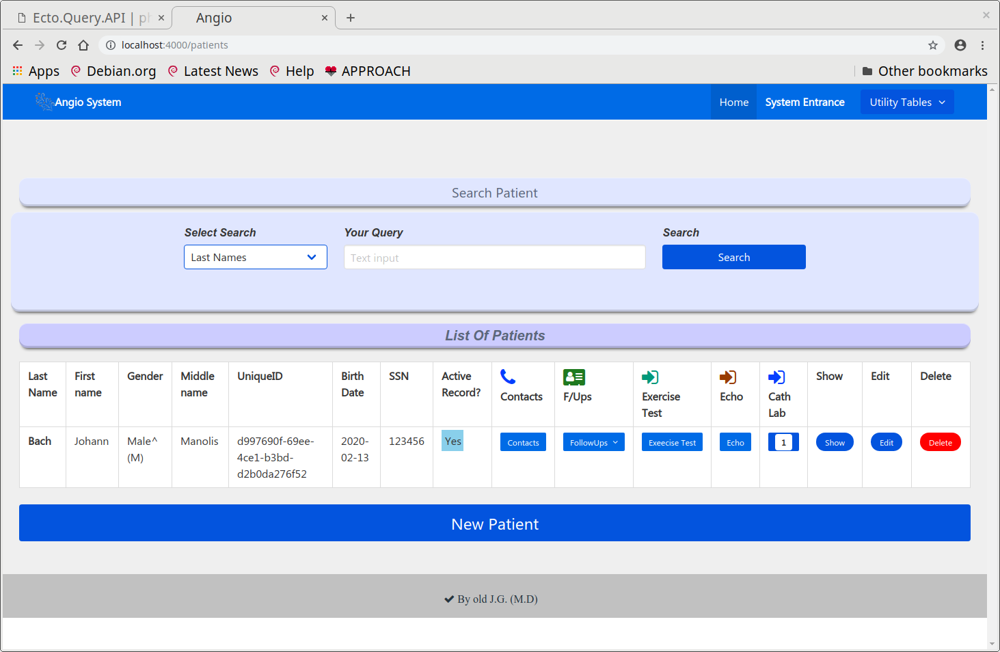
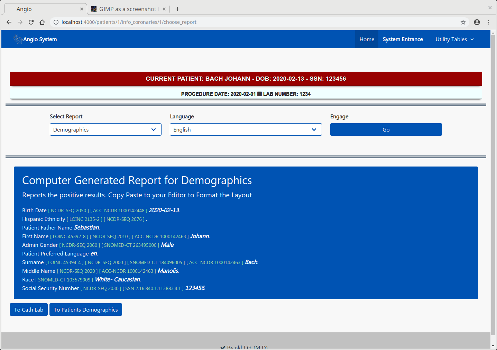
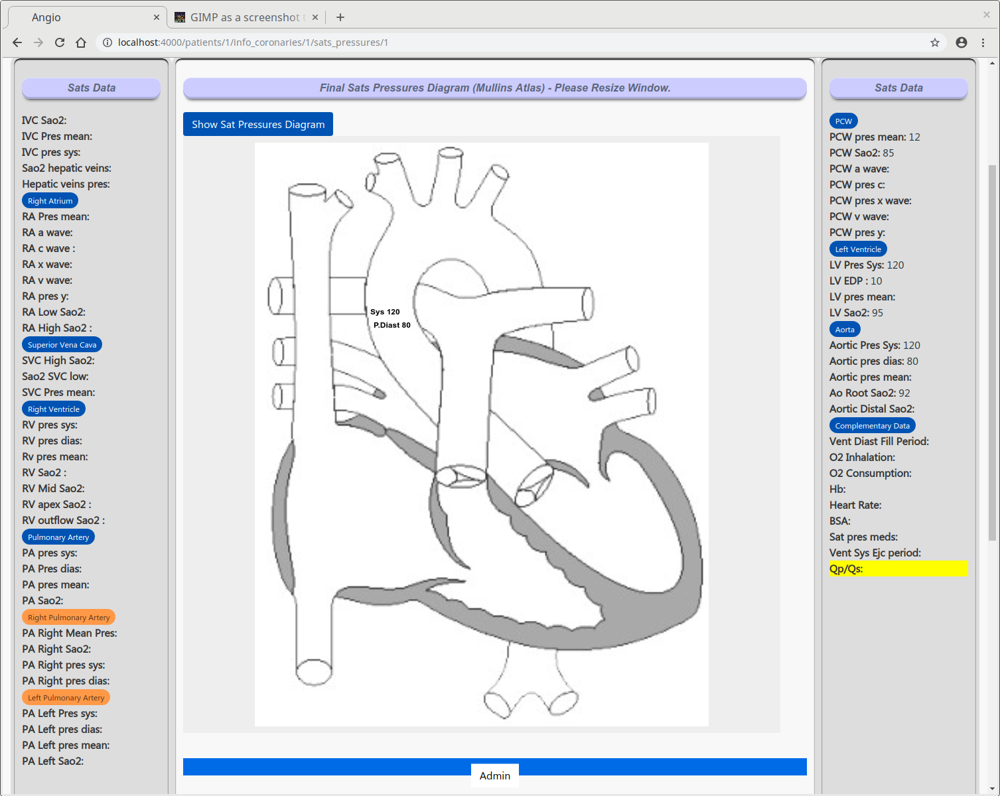
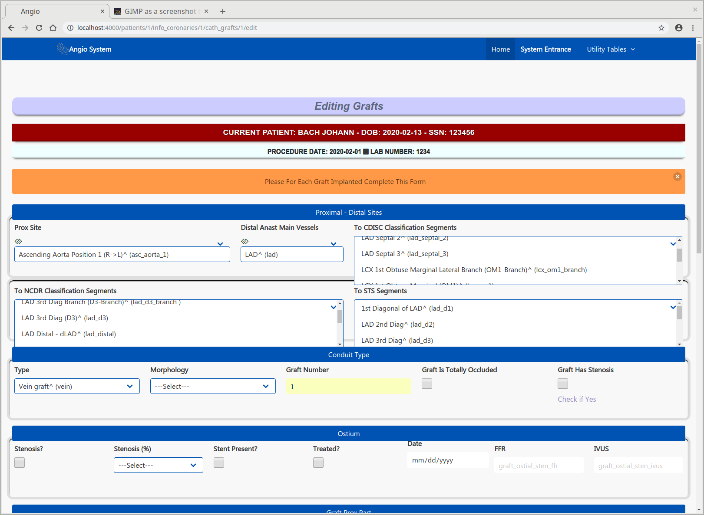
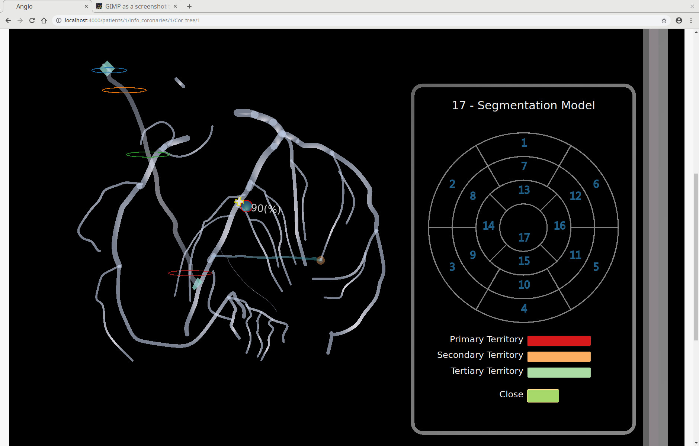

# Angio: An Information System For  Cardiology Based On Standard Definitions and Controlled Vocabularies. Work in progress

### Warning

* This piece of Software  is experimental, untested, and unstable. Interface might change significantly in the future versions.
* This project is provided AS-IS WITHOUT WARRANTY OR SUPPORT

### Functionalities
* Patient Demographics - Patient Contacts
* Past History: Infections Record - Essential Hist ( Prior Coronary - Renal Disease ... )
   Social Hist - Prior  Prodedures
* Assesment: Vital Signs - Clinical Exam Prior To Cath - Chest Pain Evaluation
* Diagnostics: ECG
* Congenitals: Care Episode - Coditions - Risk Factors
* Caths: Procedure Details - Coronary Artery Anatomy - LV - Sats Pressures -
  Complications - Radiation Dosages - The Lesions - Collaterals - Grafts, T-Grafts
* Medications
* Angio Images can be stored for each individul Patient (Limited Functionality)
* Specific Blood Lab results
* Interventions: ASD Closures, Coarctation Procedures, Aortic Balloon Valvuloplasty
* Follow Ups: ASD Closure - PCI
* Echo:  Admin, Left Atrium, Right Atrium, LV structure
* LOINC: Find a Code and Search in Short and Long common Name (Postgres Full Text Searching)

### Visualizations From the saved data (d3.js)

* The Coronary Arteries according to the Dominance, Anatomy - Frequent  Coronary Variants or Anomalies. The Grafts inserted and the T-Grafts. The Lesions in each segment of Coronaries (Segmentation Model CDISC). The Collaterals. Bulls eye.
* Saturations and Pressures on a Mullins-like diagram
* LV diagram

### A Limited narrative Summary Report can be produced in your Language

   * Some  Codes in the report are missing.

### Data Dictionary - Lexicon of Data - Data Sets

* Fields Dictionary - Terminology  (~ 3096 entries). Contains Field Name, Coding Instructions and Notes. The Fields are collected from: CathPCI, Action, TVT, NCOR, IMPACT, ICD and  Echo Standards HL-7.
* Pick-List Items (~ 4765 entries)
* Field Sentences. Sentences In Defferent Languages - Add your own - To be used in the Report
* Codes for the particular Field can be saved as: SNOMED-CT - Loinc - RxNorm - HL7 - RadLex
* Pick-List Items Sentences
* Pick-List Items Codes.

### Features

* Elixir 1.9.1
* Phoenix (1.4)
* Absinthe (Elixir GraphQL library)
* Bulma

## Please View ScreenShots in the screnshots  directory
Demographis List. Patient Bach

Naive Roport For Demographics in English

Saturations and Pressure in A Mullins Like graphical Report

 The form for each Graft inserted

Sketch of Coronary Tree according to data Entered.

  Explanation: Rigth Cor Dominance. Graft from Aorta To Distal LAD. Lesion 90% in Mid LAD. A collateral fro OM1 o Mid Lad
## To start your Phoenix server:

* Install dependencies with `mix deps.get`
* Create and migrate your database with `mix ecto.setup`
* Install Node.js dependencies with `cd assets && npm install`
* `As postgres user copy all xxx.sql in the angio_dev database from the table_backup dir`
* Start Phoenix endpoint with `mix phx.server`

### Now you can visit [`localhost:4000`](http://localhost:4000) from your browser.

## Learn more

* Official website: http://www.phoenixframework.org/
* Guides: https://hexdocs.pm/phoenix/overview.html
* Docs: https://hexdocs.pm/phoenix
* Mailing list: http://groups.google.com/group/phoenix-talk
* Source: https://github.com/phoenixframework/phoenix

